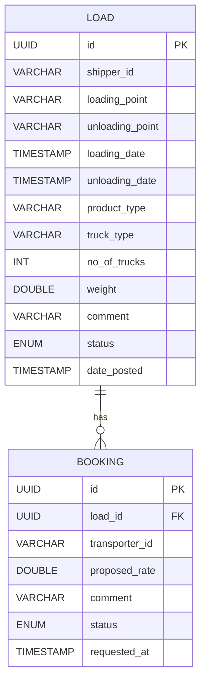

<div align="center">

# 🚛 CargoPro REST API

### A Modern Backend System for Cargo & Logistics Management

[](https://spring.io/projects/spring-boot)
[](https://www.postgresql.org/)
[](https://docs.docker.com/compose/)
[](http://localhost:8080/swagger-ui/index.html)
[](LICENSE)

[📖 Documentation](#-api-documentation) •
[🚀 Quick Start](#-quick-start) •
[💡 Features](#-features) •
[🛠️ Tech Stack](#️-technologies-used)

</div>

---

## 📋 Table of Contents

- [🌟 Project Overview](#-project-overview)
- [💡 Features](#-features)
- [🛠️ Technologies Used](#️-technologies-used)
- [🚀 Quick Start](#-quick-start)
- [📖 API Documentation](#-api-documentation)
- [🔧 Example API Usage](#-example-api-usage)
- [🗄️ Database Schema](#️-database-schema)
- [🐳 Docker Configuration](#-docker-configuration)
- [🧪 Testing](#-testing)
- [📝 Contributing](#-contributing)
- [📄 License](#-license)

---

## 🌟 Project Overview

**CargoPro** is a comprehensive backend system designed to streamline **Load and Booking operations** in the logistics industry. Built with modern technologies and best practices, it provides robust REST APIs with advanced features like automated status transitions, input validation, and real-time data management.

### 🎯 Core Functionality

| Feature | Description |
|---------|-------------|
| **🚛 Load Management** | Complete CRUD operations for cargo loads with status tracking |
| **📋 Booking Management** | End-to-end booking lifecycle with automated status updates |
| **🔄 Status Transitions** | Smart business rule enforcement for load and booking states |
| **💾 Data Persistence** | Reliable PostgreSQL storage with JPA/Hibernate ORM |
| **📊 Advanced Filtering** | Pagination, sorting, and multi-criteria search capabilities |

---

## 💡 Features

### ✨ **Business Logic**
- 🔒 **Smart Status Management** - Automated status transitions based on business rules
- 🛡️ **Data Validation** - Comprehensive input validation and error handling
- 🔄 **Referential Integrity** - Foreign key constraints and relationship management
- 📈 **Scalable Architecture** - Modular design following best practices

### 🚀 **Technical Excellence**
- 📖 **Interactive API Documentation** - Swagger/OpenAPI integration
- 🐳 **Containerized Deployment** - Docker & Docker Compose ready
- 🧪 **Comprehensive Testing** - Unit and integration test coverage
- 🌐 **RESTful Design** - Industry-standard API patterns

---

## 🛠️ Technologies Used

<div align="center">

| Category | Technologies |
|----------|-------------|
| **Backend** |   |
| **Database** |   |
| **Build & Deploy** |   |
| **Documentation** |   |
| **Testing** |   |

</div>

---

## 🚀 Quick Start

### 📋 Prerequisites

Before you begin, ensure you have the following installed:

- ☕ **Java 17 JDK** or higher
- 📦 **Maven 3.6+**
- 🐳 **Docker Desktop** (includes Docker Engine and Docker Compose)
- 🌐 **Git**

### ⚡ Setup with Docker Compose (Recommended)

1. **Clone the repository:**
   ```bash
   git clone https://github.com/YourUsername/CargoPro_Rest.git
   cd CargoPro_Rest
   ```

2. **Start the application:**
   ```bash
   docker-compose up --build
   ```
   
   > 🕒 **Wait for the startup message:** `Started LoaderBookerApplication in... seconds`

3. **Access the application:**
   - 🌐 **API Base URL:** http://localhost:8080
   - 📖 **Swagger UI:** http://localhost:8080/swagger-ui/index.html
   - 🗄️ **Database:** localhost:5432 (postgres/postgres)

4. **Stop the application:**
   ```bash
   docker-compose down
   ```

### 🛠️ Manual Setup (Alternative)

<details>
<summary>Click to expand manual setup instructions</summary>

1. **Setup PostgreSQL database:**
   ```sql
   CREATE DATABASE cargopro;
   CREATE USER cargopro_user WITH PASSWORD 'your_password';
   GRANT ALL PRIVILEGES ON DATABASE cargopro TO cargopro_user;
   ```

2. **Configure application properties:**
   ```properties
   spring.datasource.url=jdbc:postgresql://localhost:5432/cargopro
   spring.datasource.username=cargopro_user
   spring.datasource.password=your_password
   ```

3. **Build and run:**
   ```bash
   cd LoaderBooker
   mvn clean package
   java -jar target/LoaderBooker-0.0.1-SNAPSHOT.jar
   ```

</details>

---

## 📖 API Documentation

### 🌐 Interactive Documentation

Access the **Swagger UI** at: [`http://localhost:8080/swagger-ui/index.html`](http://localhost:8080/swagger-ui/index.html)

The Swagger interface provides:
- 📋 **Complete API Reference** - All endpoints with detailed descriptions
- 🧪 **Interactive Testing** - Test APIs directly from the browser
- 📝 **Request/Response Examples** - Sample payloads and responses
- 🔒 **Schema Documentation** - Data models and validation rules

---

## 🔧 Example API Usage

### 🚛 Load Management

<details>
<summary><strong>📤 Create a New Load</strong></summary>

```bash
curl -X POST "http://localhost:8080/loads" \
  -H "Content-Type: application/json" \
  -d '{
    "shipperId": "shipper-001",
    "loadingPoint": "New York",
    "unloadingPoint": "Chicago",
    "productType": "Electronics",
    "truckType": "Semi",
    "noOfTrucks": 2,
    "weight": 5000.5,
    "comment": "Fragile goods, handle with care.",
    "loadingDate": "2025-08-10T10:00:00Z",
    "unloadingDate": "2025-08-12T18:00:00Z"
  }'
```

</details>

<details>
<summary><strong>📥 Get Load by ID</strong></summary>

```bash
curl -X GET "http://localhost:8080/loads/{loadId}"
```

</details>

<details>
<summary><strong>📊 Get All Loads with Filtering</strong></summary>

```bash
curl -X GET "http://localhost:8080/loads?shipperId=shipper-001&status=POSTED&page=0&size=10"
```

</details>

### 📋 Booking Management

<details>
<summary><strong>📤 Create a New Booking</strong></summary>

```bash
curl -X POST "http://localhost:8080/bookings" \
  -H "Content-Type: application/json" \
  -d '{
    "loadId": "load-uuid-from-above",
    "transporterId": "transporter-a",
    "proposedRate": 2500.0,
    "comment": "Ready to pick up.",
    "requestedAt": "2025-08-05T09:00:00Z"
  }'
```

> ⚠️ **Note:** Bookings cannot be created for loads with `CANCELLED` status.

</details>

<details>
<summary><strong>✅ Update Booking Status</strong></summary>

```bash
curl -X PUT "http://localhost:8080/bookings/{bookingId}/status/ACCEPTED"
```

> 🔄 **Auto-Update:** This also updates the corresponding load status to `ACCEPTED`.

</details>

---

## 🗄️ Database Schema

### 📊 Entity Relationship Diagram



### 📋 Status Enumerations

| **Load Status** | **Booking Status** |
|-----------------|-------------------|
| `POSTED` | `PENDING` |
| `BOOKED` | `ACCEPTED` |
| `CANCELLED` | `REJECTED` |
| `ACCEPTED` | |
| `IN_TRANSIT` | |
| `DELIVERED` | |

---

## 🐳 Docker Configuration

### 📁 Project Structure
```
CargoPro_Rest/
├── 📄 docker-compose.yml      # Multi-container orchestration
├── 📁 LoaderBooker/
│   ├── 🐳 Dockerfile          # Spring Boot app container
│   ├── 📄 pom.xml            # Maven dependencies
│   └── 📁 src/               # Application source code
└── 📄 README.md              # This file
```

### 🔧 Docker Compose Services

| Service | Port | Description |
|---------|------|-------------|
| **app** | 8080 | Spring Boot Application |
| **db** | 5432 | PostgreSQL Database |

---

## 🧪 Testing

### 🏃‍♂️ Running Tests

```bash
# Run all tests
cd LoaderBooker
mvn test

# Run specific test class
mvn test -Dtest=BookingServiceTest

# Run tests with coverage
mvn test jacoco:report
```

### 📊 Test Categories

- **🔧 Unit Tests** - Service layer logic and validation
- **🌐 Integration Tests** - Controller and repository layers
- **📡 API Tests** - End-to-end request/response validation

---

## 📝 Contributing

We welcome contributions! Please see our contributing guidelines:

1. 🍴 **Fork** the repository
2. 🌿 **Create** a feature branch (`git checkout -b feature/amazing-feature`)
3. ✍️ **Commit** your changes (`git commit -m 'Add amazing feature'`)
4. 📤 **Push** to the branch (`git push origin feature/amazing-feature`)
5. 🔃 **Open** a Pull Request

### 📏 Code Standards

- ☕ Follow Java coding conventions
- 📝 Write comprehensive tests
- 📖 Update documentation
- 🏷️ Use conventional commit messages

---

## 📄 License

This project is licensed under the **GNU General Public License v3.0** - see the [LICENSE](LICENSE) file for details.

---

<div align="center">

### 🚛 Built with ❤️ for the Logistics Industry

**[⬆ Back to Top](#-cargopro-rest-api)**

</div>